# Comprehensive Guide to Computer Networking

## Topics
- Core Networking Concepts
- Internet Evolution
- Network Protocols
- IP Addresses (IPv4 vs IPv6) and Ports
- Types of Networks
- OSI Modal
- TCP/IP Modal
- HTTP vs HTTPS
- CORS
- What Happens When You Click a Link

### Core Networking Concepts
1. **Packets**
   - Data is broken into packets
   - Each packet contains source and destination information
   - Packets can take different routes to destination
   - Reassembled at destination

2. **Circuit Switching vs Packet Switching**
   - Circuit switching: Dedicated path (e.g., traditional phone lines)
   - Packet switching: Shared path (e.g., internet)
   - Advantages of packet switching: Scalable

3. **Network Topologies**
   - Star: Central hub with connected nodes
   - Bus: Single communication line
   - Ring: Circular connection
   - Mesh: Multiple interconnections
   - Hybrid: Combination of topologies

## The Internet Evolution

The internet's development can be traced back to the Cold War era:

1. **ARPANET (1969)**
   - First packet-switched network
   - Connected four universities
   - Used NCP (Network Control Protocol)
   - Key innovations:Packet switching, Distributed network, Fault tolerance

2. **TCP/IP Protocol (1974)**
   - Developed by Vint Cerf and Bob Kahn
   - Standardized communication between different networks
   - Key components:
     - TCP: Reliable data delivery
     - IP: Addressing and routing
   - Became standard in 1983

3. **World Wide Web (1989)**
   - Invented by Tim Berners-Lee
   - Key components:
     - URLs: Uniform Resource Locators
     - HTTP: Hypertext Transfer Protocol
     - HTML: Hypertext Markup Language
     - Web browsers
   - Revolutionized information sharing

## Network Protocols (Standards)

1. **TCP (Transmission Control Protocol)**
   - Connection-oriented protocol
   - Features:Reliable data delivery, Error checking and correction, Flow control, Congestion control
   - Three-way handshake:
     ```mermaid
     sequenceDiagram
         participant Client
         participant Server
         Client->>Server: SYN
         Server->>Client: SYN-ACK
         Client->>Server: ACK
     ```
   - TCP Header Structure:
     ```
     ┌─────────────────────────────────────────────────┐
     │ Source Port (16 bits) │ Destination Port (16 bits) │
     ├─────────────────────────────────────────────────┤
     │ Sequence Number (32 bits)                        │
     ├─────────────────────────────────────────────────┤
     │ Acknowledgment Number (32 bits)                  │
     ├─────────────────────────────────────────────────┤
     │ Data Offset │ Reserved │ Flags │ Window Size     │
     ├─────────────────────────────────────────────────┤
     │ Checksum (16 bits) │ Urgent Pointer (16 bits)    │
     ├─────────────────────────────────────────────────┤
     │ Options (variable)                               │
     └─────────────────────────────────────────────────┘
     ```

2. **UDP (User Datagram Protocol)**
   - Connectionless protocol
   - Features:
     - No connection establishment
     - No error recovery
     - No flow control
     - Lower overhead
   - Use cases:
     - Video streaming
     - Online gaming
     - DNS queries
     - VoIP
   - UDP Header Structure:
     ```
     ┌─────────────────────────────────────────────────┐
     │ Source Port (16 bits) │ Destination Port (16 bits) │
     ├─────────────────────────────────────────────────┤
     │ Length (16 bits) │ Checksum (16 bits)             │
     └─────────────────────────────────────────────────┘
     ```

3. **HTTP/HTTPS**
   - Application layer protocol
   - HTTP Methods:
     - GET: Retrieve data
     - POST: Send data
     - PUT: Update data
     - DELETE: Remove data
     - HEAD: Get headers only
     - OPTIONS: Get allowed methods
   - HTTP Status Codes:
     - 1xx: Informational
     - 2xx: Success
     - 3xx: Redirection
     - 4xx: Client Error
     - 5xx: Server Error
   - HTTPS:
     - SSL/TLS encryption
     - Certificate verification
     - Secure key exchange

## IP Addresses (IPv4 vs IPv6) and Ports

| Feature | IPv4 | IPv6 |
|---------|------|------|
| Address Length | 32-bit (4 bytes) | 128-bit (16 bytes) |
| Address Format | xxx.xxx.xxx.xxx | xxxx:xxxx:xxxx:xxxx:xxxx:xxxx:xxxx:xxxx |
| Address Space | Limited (4.3 billion) | Virtually unlimited |
| Address Classes | A: 1.0.0.0 to 126.255.255.255<br>B: 128.0.0.0 to 191.255.255.255<br>C: 192.0.0.0 to 223.255.255.255<br>D: 224.0.0.0 to 239.255.255.255 (Multicast)<br>E: 240.0.0.0 to 255.255.255.255 (Reserved) | Not applicable (uses different addressing scheme) |
| Private IP Ranges | 10.0.0.0/8<br>172.16.0.0/12<br>192.168.0.0/16 | Uses Unique Local Addresses (ULA) |
| Security | Optional (IPSec) | Built-in (IPSec) |
| Multicast Support | Limited | Enhanced |
| Header Complexity | Complex | Simplified |
| Address Types | Unicast, Broadcast, Multicast | Unicast, Multicast, Anycast |

| Port Range | Type | Description | Common Examples |
|------------|------|-------------|-----------------|
| 0-1023 | Well-Known | System/root services | 20/21: FTP<br>22: SSH<br>80: HTTP<br>443: HTTPS<br>53: DNS |
| 1024-49151 | Registered | Assigned by IANA for applications | 3306: MySQL<br>5432: PostgreSQL<br>27017: MongoDB<br>6379: Redis |
| 49152-65535 | Dynamic/Private | Temporary/ephemeral connections | Assigned by OS for client connections |

## Types of Networks

| Network Type | Description | Characteristics | Common Use Cases | Technologies |
|-------------|-------------|-----------------|-----------------|--------------|
| **LAN (Local Area Network)** | Connects devices in a limited area | - High bandwidth<br>- Low latency<br>- Private ownership<br>- Limited geographic area | - Office networks<br>- Home networks<br>- School networks | - Ethernet<br>- Wi-Fi<br>- Token Ring<br>- FDDI |
| **WAN (Wide Area Network)** | Spans large geographic areas | - Multiple LANs connected<br>- Public/private infrastructure<br>- Lower bandwidth than LAN<br>- Higher latency | - Internet<br>- Corporate networks<br>- Global organizations | - MPLS<br>- Frame Relay<br>- ATM<br>- SD-WAN |
| **MAN (Metropolitan Area Network)** | Covers a city or large campus | - Medium geographic area<br>- High-speed connections<br>- Multiple LANs connected | - City-wide networks<br>- University campuses<br>- Government networks | - Metro Ethernet<br>- DWDM<br>- SONET |
| **PAN (Personal Area Network)** | Connects personal devices | - Very short range<br>- Low power consumption<br>- Personal use | - Smart home devices<br>- Wearables<br>- Personal computers | - Bluetooth<br>- Zigbee<br>- NFC<br>- Infrared |
| **CAN (Campus Area Network)** | Connects multiple LANs in a campus | - Limited to specific campus<br>- High-speed connections<br>- Multiple buildings | - University campuses<br>- Business parks<br>- Military bases | - Ethernet<br>- Fiber optics<br>- Wireless bridges |
| **SAN (Storage Area Network)** | Dedicated high-speed storage network | - High performance<br>- Block-level storage<br>- Dedicated infrastructure | - Data centers<br>- Enterprise storage<br>- Cloud storage | - Fibre Channel<br>- iSCSI<br>- FCoE |
| **VPN (Virtual Private Network)** | Secure network over public infrastructure | - Encrypted connections<br>- Remote access<br>- Secure tunneling | - Remote work<br>- Secure communications<br>- Bypassing restrictions | - IPsec<br>- SSL/TLS<br>- OpenVPN<br>- WireGuard |
| **WLAN (Wireless LAN)** | Wireless local area network | - No physical cables<br>- Mobility<br>- Variable signal strength | - Mobile devices<br>- IoT devices<br>- Public hotspots | - Wi-Fi (802.11)<br>- Li-Fi<br>- Wireless mesh |
| **SDN (Software-Defined Network)** | Network managed by software | - Centralized control<br>- Programmable<br>- Virtualized | - Cloud computing<br>- Data centers<br>- Enterprise networks | - OpenFlow<br>- Network virtualization<br>- SD-WAN |

### Network Topologies

| Topology | Description | Advantages | Disadvantages | Common Use Cases |
|----------|-------------|------------|---------------|-----------------|
| **Star** | Central hub with connected nodes | - Easy to manage<br>- Fault isolation<br>- Easy to add/remove nodes | - Single point of failure<br>- Requires more cabling | - Home networks<br>- Office networks<br>- Small businesses |
| **Bus** | Single communication line | - Simple design<br>- Less cabling<br>- Easy to implement | - Difficult to troubleshoot<br>- Limited scalability<br>- Single point of failure | - Legacy networks<br>- Small networks<br>- Temporary setups |
| **Ring** | Circular connection of nodes | - Equal access to resources<br>- No collisions<br>- Good performance | - Single point of failure<br>- Difficult to add/remove nodes<br>- Complex troubleshooting | - Token Ring networks<br>- FDDI networks<br>- Some WANs |
| **Mesh** | Multiple interconnections | - High redundancy<br>- Multiple paths<br>- High reliability | - Complex design<br>- High cost<br>- Difficult to manage | - Military networks<br>- Critical infrastructure<br>- Data centers |
| **Tree** | Hierarchical structure | - Scalable<br>- Easy to manage<br>- Good for large networks | - Complex design<br>- Single point of failure at root<br>- Requires careful planning | - Enterprise networks<br>- ISP networks<br>- Large organizations |
| **Hybrid** | Combination of topologies | - Flexible<br>- Customizable<br>- Optimized for needs | - Complex design<br>- Difficult to manage<br>- Higher cost | - Large enterprises<br>- Complex networks<br>- Custom solutions |

## Network Infrastructure

### Connection Methods

1. **Wired Connections**
   - Ethernet:
     - Categories: Cat5, Cat5e, Cat6, Cat6a
     - Speeds: 10Mbps to 10Gbps
     - Distance: Up to 100m
   - Fiber Optics:
     - Types: Single-mode, Multi-mode
     - Speeds: Up to 100Gbps
     - Distance: Up to 40km
   - Coaxial:
     - Used in cable internet
     - Speeds: Up to 1Gbps
     - Distance: Up to 500m

2. **Wireless Connections**
   - Wi-Fi Standards:
     - 802.11a: 5GHz, 54Mbps
     - 802.11b: 2.4GHz, 11Mbps
     - 802.11g: 2.4GHz, 54Mbps
     - 802.11n: 2.4/5GHz, 600Mbps
     - 802.11ac: 5GHz, 1.3Gbps
     - 802.11ax: 2.4/5GHz, 10Gbps
   - Cellular:
     - 3G: Up to 2Mbps
     - 4G: Up to 100Mbps
     - 5G: Up to 10Gbps
   - Bluetooth:
     - Versions: 1.0 to 5.3
     - Range: Up to 100m
     - Speed: Up to 2Mbps

## OSI Model

The OSI (Open Systems Interconnection) model consists of seven layers:

```
┌─────────────────────────────────────────────────┐
│                    Application                   │ Layer 7
├─────────────────────────────────────────────────┤
│                    Presentation                 │ Layer 6
├─────────────────────────────────────────────────┤
│                      Session                    │ Layer 5
├─────────────────────────────────────────────────┤
│                      Transport                  │ Layer 4
├─────────────────────────────────────────────────┤
│                      Network                    │ Layer 3
├─────────────────────────────────────────────────┤
│                      Data Link                  │ Layer 2
├─────────────────────────────────────────────────┤
│                      Physical                   │ Layer 1
└─────────────────────────────────────────────────┘
```

### Layer Functions

1. **Physical Layer (Layer 1)**
   - Functions:
     - Bit transmission
     - Physical topology
     - Signal encoding
     - Transmission mode
   - Devices:
     - Hubs
     - Repeaters
     - Cables
     - Connectors
   - Protocols:
     - Ethernet
     - USB
     - Bluetooth
     - IEEE 802.11

2. **Data Link Layer (Layer 2)**
   - Functions:
     - Frame creation
     - Error detection
     - Flow control
     - MAC addressing
   - Sublayers:
     - LLC (Logical Link Control)
     - MAC (Media Access Control)
   - Protocols:
     - Ethernet
     - PPP
     - HDLC
     - Frame Relay

3. **Network Layer (Layer 3)**
   - Functions:
     - Routing
     - Logical addressing
     - Path determination
     - Packet forwarding
   - Protocols:
     - IP
     - ICMP
     - ARP
     - OSPF
     - BGP

4. **Transport Layer (Layer 4)**
   - Functions:
     - End-to-end communication
     - Error recovery
     - Flow control
     - Multiplexing
   - Protocols:
     - TCP
     - UDP
     - SCTP
     - DCCP

5. **Session Layer (Layer 5)**
   - Functions:
     - Session establishment
     - Session maintenance
     - Session termination
     - Dialog control
   - Protocols:
     - NetBIOS
     - PPTP
     - L2TP
     - SOCKS

6. **Presentation Layer (Layer 6)**
   - Functions:
     - Data translation
     - Encryption/decryption
     - Compression
     - Character encoding
   - Protocols:
     - SSL/TLS
     - MIME
     - XDR
     - ASCII

7. **Application Layer (Layer 7)**
   - Functions:
     - User interface
     - Application services
     - Network services
     - Resource sharing
   - Protocols:
     - HTTP
     - FTP
     - SMTP
     - DNS
     - DHCP

## HTTP vs HTTPS

### HTTP (Hypertext Transfer Protocol)

1. **Basic Characteristics**
   - Stateless protocol
   - Text-based
   - Port 80
   - No encryption
   - Faster than HTTPS

2. **HTTP Request Structure**
   ```
   GET /index.html HTTP/1.1
   Host: www.example.com
   User-Agent: Mozilla/5.0
   Accept: text/html
   Accept-Language: en-US
   Connection: keep-alive
   ```

3. **HTTP Response Structure**
   ```
   HTTP/1.1 200 OK
   Date: Mon, 23 May 2005 22:38:34 GMT
   Content-Type: text/html; charset=UTF-8
   Content-Length: 138
   Last-Modified: Wed, 08 Jan 2003 23:11:55 GMT
   Server: Apache/1.3.3.7 (Unix) (Red-Hat/Linux)
   ```

### HTTPS (Hypertext Transfer Protocol Secure)

1. **Basic Characteristics**
   - Secure version of HTTP
   - Port 443
   - Uses SSL/TLS encryption
   - Slower than HTTP
   - Requires certificates

2. **SSL/TLS Handshake**
   ```mermaid
   sequenceDiagram
       participant Client
       participant Server
       Client->>Server: Client Hello
       Server->>Client: Server Hello + Certificate
       Client->>Server: Client Key Exchange
       Server->>Client: Server Hello Done
       Client->>Server: Change Cipher Spec
       Server->>Client: Change Cipher Spec
       Client->>Server: Encrypted Data
   ```

3. **Certificate Components**
   - Public key
   - Subject information
   - Issuer information
   - Validity period
   - Digital signature
   - Extensions

## CORS (Cross-Origin Resource Sharing)
# CORS (Cross-Origin Resource Sharing)

## What is CORS?

**Cross-Origin Resource Sharing (CORS)** is a security feature implemented by web browsers that controls how web applications can request resources from a different origin (domain, protocol, or port) than the one from which the web application was loaded. This is important for protecting user data and maintaining security on the web.

## Why Do We Need CORS?

Web browsers enforce the **same-origin policy** to prevent malicious websites from accessing sensitive information from another origin. For example, if you visit `example.com`, a script running there should not be able to access resources from `another-domain.com` without permission. CORS allows web servers to declare which cross-origin requests are allowed, helping to safely share resources across different domains.

## How Does CORS Work?

CORS uses HTTP headers to communicate permissions between the server and the browser. Here's how it typically works:

1. **Making a Request:** When a web application (like JavaScript code) wants to request a resource from a different origin, the browser sends an **HTTP request** to that server.

2. **Preflight Request (for certain requests):** Before sending the actual request (especially for methods like POST, PUT, DELETE), the browser sometimes sends a **OPTIONS request** (known as a preflight request) to check if the CORS protocol is understood by the server.

3. **Server Response:** The server responds with specific CORS headers in its response. These headers dictate whether the request is allowed or not.

## Key CORS Headers

Here are the commonly used CORS headers:

- **`Access-Control-Allow-Origin`**: Specifies which origins (domains) are allowed to access the resource. This could be a specific domain or a wildcard (`*`) to allow all origins.

- **`Access-Control-Allow-Credentials`**: Indicates whether the browser should include credentials (like cookies or authorization headers) with requests to the server.

- **`Access-Control-Allow-Headers`**: Lists which request headers the client can use when making the actual request.

- **`Access-Control-Allow-Methods`**: Specifies which HTTP methods (GET, POST, etc.) are allowed for the resource when accessed from a different origin.

- **`Access-Control-Expose-Headers`**: Lists which response headers the client can access.

- **`Access-Control-Max-Age`**: Specifies how long the results of a preflight request can be cached, reducing the need for repeated checks.

- **`Origin`**: Sent by the browser to indicate the origin of the request. This helps the server determine whether or not to allow the request.

## Example Scenario

Imagine you're building a web application on `app.example.com` that needs to access data from an API at `api.another-domain.com`. Without CORS, the browser would block this request due to the same-origin policy. However, if the API server at `api.another-domain.com` responds with `Access-Control-Allow-Origin: app.example.com`, the browser allows the request because the server explicitly permits it.

## Visual Summary

Here's a quick visual summary of how CORS operates:

1. **Client (Browser)** → Sends a request to a server on a different origin.
2. **Server** → Responds with specific CORS headers to indicate permissions.
3. **Browser** → Checks these headers and decides whether to allow access to the resource.


## What Happens When You Click a Link

## Detailed Process

```mermaid
flowchart LR
  A["User clicks on https://www.google.com"] --> B["Browser parses URL"]
  B --> C{"Is domain cached?"}
  C -- Yes --> D["Use cached IP address"]
  C -- No --> E["Check OS DNS cache"]
  E --> F{"Found in cache?"}
  F -- Yes --> D
  F -- No --> G["Send DNS query to resolver (ISP or 8.8.8.8)"]
  G --> H["Resolver checks its cache"]
  H --> I{"Found in cache?"}
  I -- Yes --> D
  I -- No --> J["Query Root DNS servers"]
  J --> K["Get TLD DNS server for .com"]
  K --> L["Get Authoritative DNS server for google.com"]
  L --> M["Get IP address for www.google.com"]
  M --> D

  D --> N["Start TCP 3-way handshake (SYN, SYN-ACK, ACK)"]
  N --> O["Perform TLS handshake (certificates, keys)"]
  O --> P["Send HTTPS GET request for /"]
  P --> Q["Packet travels through router, ISP, and Internet"]

  Q --> R["Google's server receives request"]
  R --> S["Server processes request (web server, backend, DB)"]
  S --> T["Server sends HTTP response (HTML, CSS links, JS)"]
  T --> U["Response travels back to client"]

  U --> V["Browser receives HTML and starts rendering"]
  V --> W["Build DOM tree from HTML"]
  W --> X["Fetch linked resources (CSS, JS, images)"]
  X --> Y["Create Render Tree (DOM + CSS)"]
  Y --> Z["Layout: calculate positions"]
  Z --> AA["Paint: draw pixels on screen"]

  AA --> AB{"All resources loaded?"}
  AB -- Yes --> AC["Fire window.onload event"]
  AC --> AD["Page is fully interactive"]
```



## Step-by-Step Explanation

### 1. URL Parsing and DNS Resolution

1. **URL Parsing**
   - Browser breaks down the URL into components:
     - Protocol: `https://`
     - Domain: `www.google.com`
     - Path: `/`
   - Determines if the request needs to be secure (HTTPS)

2. **DNS Cache Check**
   - **Browser Cache**: First checks its own DNS cache
   - **OS Cache**: If not found, checks operating system's DNS cache
   - **Resolver Cache**: If still not found, checks ISP's DNS resolver cache
   - **DNS Resolution Process**:
     - Root DNS servers (13 worldwide)
     - TLD (Top-Level Domain) servers (.com, .org, etc.)
     - Authoritative DNS servers (google.com's nameservers)

3. **DNS Query Types**
   - **Recursive Query**: Client asks resolver to find the answer
   - **Iterative Query**: Resolver asks other DNS servers
   - **Caching**: Results are cached at each level

### 2. TCP Connection and TLS Handshake

1. **TCP Three-Way Handshake**
   ```mermaid
   sequenceDiagram
       participant Client
       participant Server
       Client->>Server: SYN (Synchronize)
       Server->>Client: SYN-ACK (Synchronize-Acknowledge)
       Client->>Server: ACK (Acknowledge)
   ```
   - **SYN**: Client initiates connection with sequence number
   - **SYN-ACK**: Server acknowledges and sends its sequence number
   - **ACK**: Client acknowledges server's sequence number

2. **TLS Handshake**
   ```mermaid
   sequenceDiagram
       participant Client
       participant Server
       Client->>Server: Client Hello (supported ciphers)
       Server->>Client: Server Hello + Certificate
       Client->>Server: Client Key Exchange
       Server->>Client: Server Hello Done
       Client->>Server: Change Cipher Spec
       Server->>Client: Change Cipher Spec
       Client->>Server: Encrypted Data
   ```
   - **Certificate Verification**: Client verifies server's SSL certificate
   - **Key Exchange**: Diffie-Hellman or RSA key exchange
   - **Cipher Suite**: Agree on encryption algorithms
   - **Session Keys**: Generate keys for secure communication

### 3. HTTP Request and Response

1. **HTTPS Request**
   ```http
   GET / HTTP/1.1
   Host: www.google.com
   User-Agent: Mozilla/5.0
   Accept: text/html,application/xhtml+xml
   Accept-Language: en-US
   Connection: keep-alive
   ```
   - **Headers**: Include client capabilities and preferences
   - **Method**: GET, POST, etc.
   - **Path**: Resource being requested
   - **Protocol**: HTTP/1.1 or HTTP/2

2. **Network Routing**
   - **Local Network**: Router forwards packet to ISP
   - **ISP Network**: Routes through ISP's infrastructure
   - **Internet Backbone**: Travels through major network hubs
   - **Peering Points**: Exchanges between networks
   - **CDN**: May be intercepted by Content Delivery Network

3. **Server Processing**
   - **Web Server**: Apache, Nginx, etc.
   - **Application Server**: Processes business logic
   - **Database**: Retrieves/store data
   - **Caching**: Checks various cache layers
   - **Load Balancing**: Distributes request if needed

### 4. Browser Rendering

1. **HTML Parsing**
   - **Tokenization**: Breaks HTML into tokens
   - **DOM Tree**: Creates Document Object Model
   - **CSSOM**: Creates CSS Object Model
   - **JavaScript Execution**: Parses and executes scripts

2. **Resource Loading**
   - **Parallel Loading**: Multiple resources load simultaneously
   - **Priority Queue**: Critical resources load first
   - **Cache Control**: Checks cache headers
   - **Preload Scanner**: Looks ahead for resources

3. **Rendering Pipeline**
   - **Style Calculation**: Computes final styles
   - **Layout**: Calculates element positions
   - **Paint**: Creates layers and draws pixels
   - **Compositing**: Combines layers efficiently

4. **Page Load Events**
   - **DOMContentLoaded**: HTML parsed, DOM ready
   - **Load**: All resources loaded
   - **First Paint**: First pixels on screen
   - **Time to Interactive**: Page fully interactive

## Technical Terms Explained

1. **DNS (Domain Name System)**
   - Hierarchical naming system
   - Converts domain names to IP addresses
   - Uses UDP port 53
   - Distributed database system

2. **TCP (Transmission Control Protocol)**
   - Connection-oriented protocol
   - Reliable data delivery
   - Flow control and congestion control
   - Error checking and recovery

3. **TLS (Transport Layer Security)**
   - Cryptographic protocol
   - Provides secure communication
   - Uses asymmetric and symmetric encryption
   - Certificate-based authentication

4. **HTTP/HTTPS**
   - Application layer protocol
   - Stateless request-response model
   - Headers for metadata
   - Methods for different operations

5. **Rendering Engine**
   - Parses HTML/CSS
   - Creates DOM/CSSOM trees
   - Calculates layout
   - Paints pixels
   - Handles JavaScript execution

6. **Cache**
   - Temporary storage
   - Reduces network requests & Improves performance
   - Multiple levels (browser, OS, DNS)

1. **CDN (Content Delivery Network)**
   - Distributed server network
   - Caches content closer to users
   - Reduces latency & Improves availability 

## Advanced Networking Concepts

### Network Security

1. **Firewalls**
   - Types:
     - Packet-filtering
     - Stateful inspection
     - Application-level
     - Next-generation
   - Rules:
     - Allow/deny
     - Port filtering
     - IP filtering
     - Protocol filtering

2. **VPNs**
   - Types:
     - Site-to-site
     - Remote access
     - Client-to-site
   - Protocols:
     - IPsec
     - SSL/TLS
     - PPTP
     - L2TP

3. **Intrusion Detection/Prevention**
   - Signature-based
   - Anomaly-based
   - Behavior-based
   - Hybrid systems

### Network Performance

1. **QoS (Quality of Service)**
   - Traffic prioritization
   - Bandwidth management
   - Latency control
   - Packet loss prevention

2. **Load Balancing**
   - Algorithms:
     - Round-robin
     - Least connections
     - IP hash
     - Weighted
   - Types:
     - Hardware
     - Software
     - DNS-based

3. **Caching**
   - Browser caching
   - CDN caching
   - Proxy caching
   - Application caching

### Network Troubleshooting

1. **Tools**
   - ping
   - traceroute
   - netstat
   - tcpdump
   - Wireshark
   - nmap

2. **Common Issues**
   - DNS resolution
   - Connection timeouts
   - Packet loss
   - Bandwidth congestion
   - Firewall blocks

3. **Debugging Steps**
   - Verify connectivity
   - Check DNS resolution
   - Test port availability
   - Analyze traffic
   - Check firewall rules
   - Verify routing
